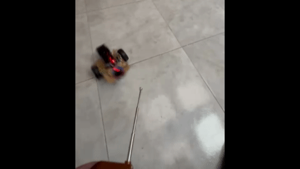
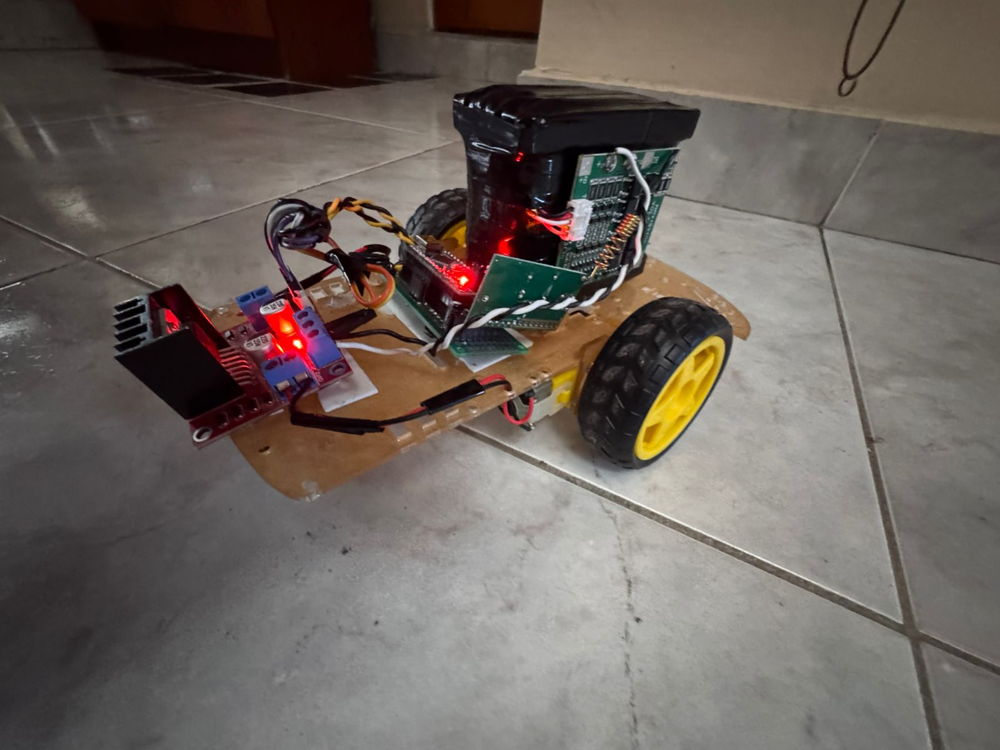
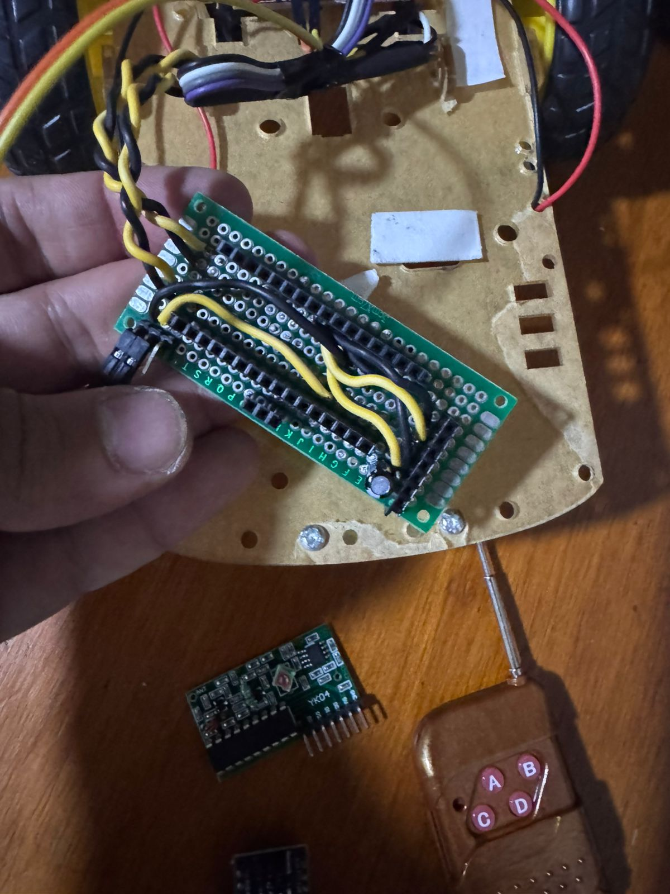
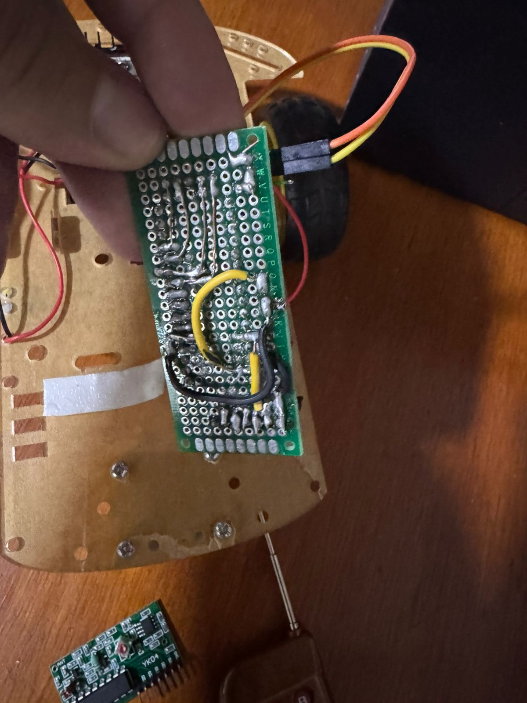
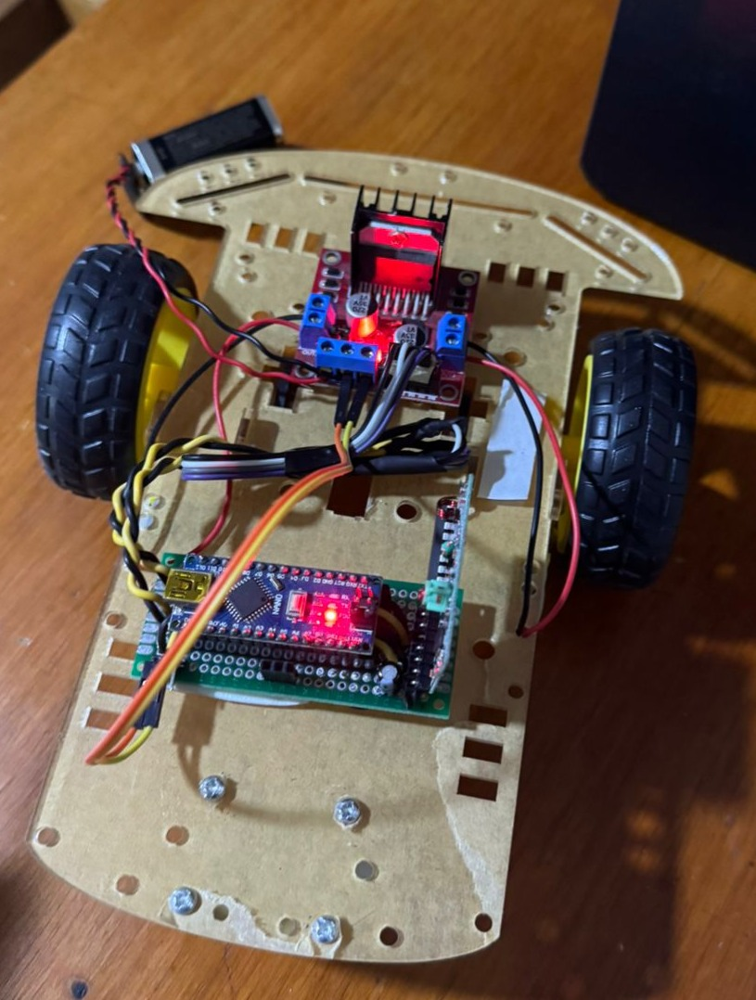

<p align="center">
  <a href="http://nipoanz.com/" target="_blank" rel="noopener noreferrer">
  
  </a>
</p>

# RC CAR

RC Car with Arduino Nano and 315 MHz RF Remote





---

## Table of Contents
1. [Introduction](#introduction)
2. [Objective](#objective)
3. [Components](#components)
4. [Connection](#connection)
5. [Installation](#installation)
6. [Usage](#usage)
7. [Images](#images)
8. [Author](#author)
9. [License](#license)
10. [Contributing](#contributing)

---

## Introduction

This project features a remote-controlled car built with an Arduino Nano, using a 315 MHz YK04 RF receiver module. The car is driven by an L298N motor driver and is operated by a basic 4-channel RF remote (buttons A, B, C, D) to move forward, backward, and turn. The design is lightweight and does not require Bluetooth, Wi-Fi, or other.

---

## Objective

The goal is to create a responsive, reliable, and minimal RC vehicle using:

- 4-channel RF communication
- PWM-based motor speed control
- Dual-button press logic to toggle between speed modes

---

## Components

- Arduino Nano
- YK04 315 MHz RF Receiver Module
- 4-button 315 MHz RF Remote
- L298N Motor Driver
- 2x DC Motors
- Jumper Wires
- Power Supply (e.g., 7.4V Li-Ion battery pack)

<p align="center">
  
</p>


<p align="center">
  
</p>
---

## Connection

### Pin Mapping

| Component            | Pin on Arduino |
|----------------------|----------------|
| YK04 - Button A      | D2             |
| YK04 - Button B      | D3             |
| YK04 - Button C      | D4             |
| YK04 - Button D      | D5             |
| L298N - IN1          | D6             |
| L298N - IN2          | D7             |
| L298N - IN3          | D8             |
| L298N - IN4          | D9             |
| L298N - ENA (PWM)    | D10            |
| L298N - ENB (PWM)    | D11            |
| Power GND            | GND            |
| Power VCC            | VIN or 5V      |


<p align="center">
  
</p>

---

## Installation

1. Clone the repository:
```bash
git clone https://github.com/your-username/rc-car-yk04.git
cd rc-car-yk04
```

2. Open the project in the Arduino IDE.

3. Install the required libraries:

 - Download from: https://github.com/YuriiSalimov/YK04_Module
 - Add it via Sketch > Include Library > Add .ZIP Library

4. Connect your Arduino Nano and upload the main.ino sketch.

## Usage

Controls:
 - A → Move forward
 - B → Move backward    
 - C → Turn left (by reversing left motor and forwarding right)
 - D → Turn right (by forwarding left motor and reversing right)
 - A + B or C + D → Toggle speed (Low ↔ High)

---

## Images

<p align="center">
  
</p>

<p align="center">
  
</p>


<p align="center">
  
</p>


## Author
    Nicolás Potier – [GitHub Profile](https://github.com/potier97)

## License
This project is licensed under the MIT License - see the [LICENSE](LICENSE) file for details.

## Contributing
Contributions, issues, and feature requests are welcome!

1. Fork the repository

2. Create a new branch:

 ```
 git checkout -b feature/your-feature-name
 ```

3. Make your changes

4. Push to the branch:

 ```
 git push origin feature/your-feature-name
 ```

5. Submit a pull request
